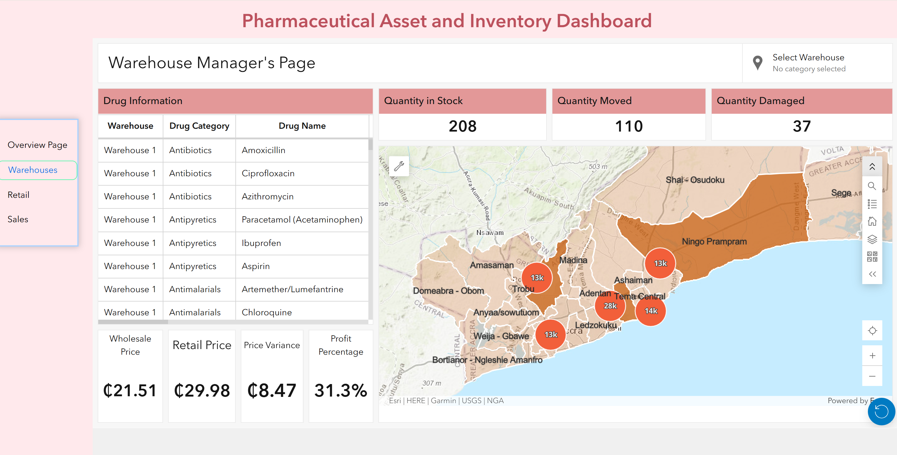
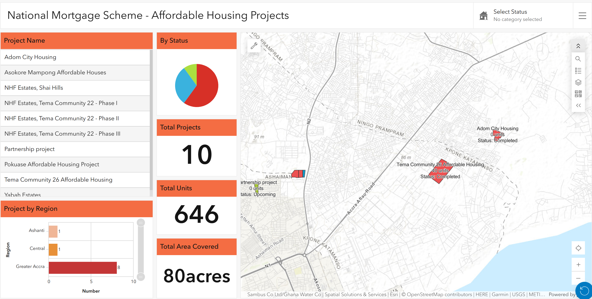
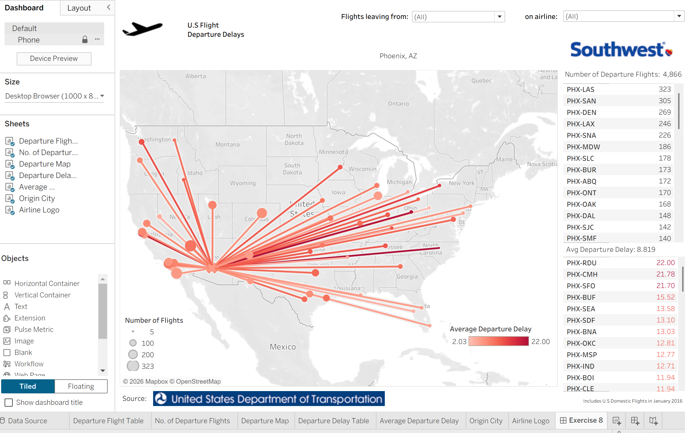

# Mabel Tsadia — Data & Systems Analysis Portfolio
Data analysis and dashboard projects — Tableau, ArcGIS Online, and SQL work from graduate coursework and industry experience

**Pharmaceutical Inventory Management Dashboard** — Big Data Ghana
Inventory tracking across retail and wholesale supply chain tiers.
🔗 [Live dashboard link](https://experience.arcgis.com/experience/9ff29c7f1d7f4e10bef7ec6e58441c2e)
*Built using synthetic/sample data for demonstration purposes.*

**Ghana Affordable Housing Project Tracker** — Big Data Ghana (ArcGIS Online)
Geographic dashboard tracking project locations and completion status 
(finished vs. not-started) to support accountability and transparency.
*Screenshot shown; live dashboard not published publicly as it contains project data not cleared for external sharing.*

**Flight Delay Analysis Dashboard** — MS AIB Coursework (Tableau)
Operational efficiency and delay pattern analysis.
🔗[ Tableau Public link](https://public.tableau.com/views/FlightDelaysDashboard_MabelTsadia/Exercise8?:language=en-US&publish=yes&:sid=&:redirect=auth&:display_count=n&:origin=viz_share_link))

